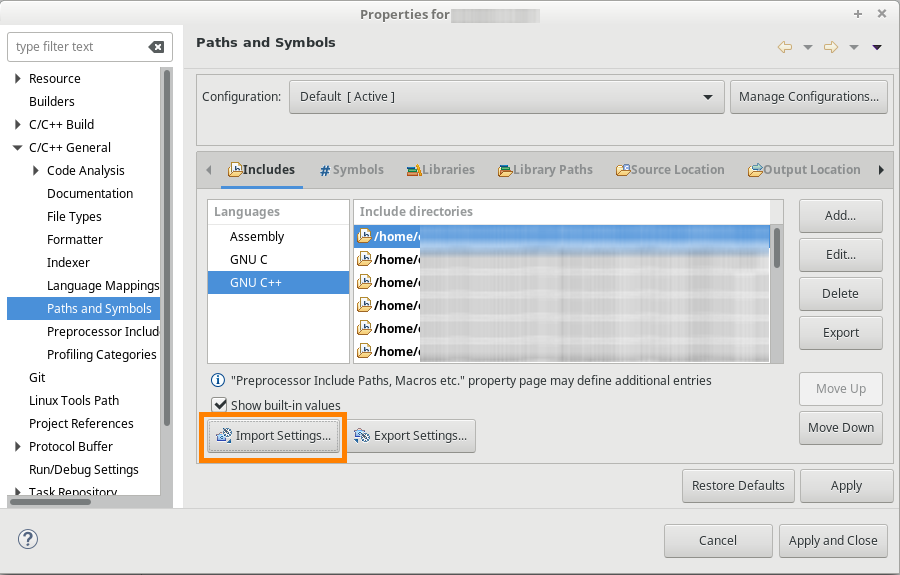

# Description
Eclipse CDT includes XML file generator.

When importing C or C++ project into Eclipse CDT, you also need to configure the include directories properly to make the Indexer working.
In the Project->Properties->C/C++ General->Paths and Symbols->Includes you have two options:
* Go through your project file structure, identify directories containing header files and Add manually record for each one of them.
* Or use this script to do it for you and Import the generated XML settings file.

# Usage
    usage: gen_cdt_settings.py [-h] [-v] [--ignore-c] [--ignore-cpp] out_file

    positional arguments:
      out_file       specify the output file filename

    optional arguments:
      -h, --help     show this help message and exit
      -v, --verbose  turn on verbose mode
      --ignore-c     ignore C header files
      --ignore-cpp   ignore C++ header files
      
## Example

    C:\Users\user\Documents\Project> python ..\..\cdt_includes_gen\gen_cdt_settings.py settings.xml
    Searching for C header files.
    Searching for C++ header files.
    Writting settings file to settings.xml.
    Done.

The script has generated a settings.xml file containing the include directories with C and C++ header files.

In your Eclipse project properties, import the generated file.

   

